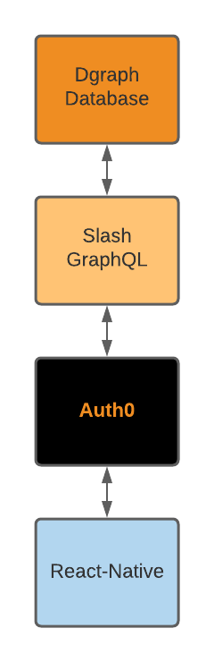

# wfh-workouts

A mobile app that gives users a new workout to do throughout their normal work day.

## Features

- Each day you get a workout that can be completed over the course of your work day.
- The app has a built-in timer to remind you to do your next interval.

## Workouts

Workouts consist of intervals such as:

> Every 15 minutes
> 
> Do 15 push-ups 
> 
> Until you get to 60

then,

> Every 15 minutes
> 
> Do 20 sit-ups
> 
> Until you get 80

These workouts are designed to get you moving throughout the day, doing strength training, that doesn't require much cardio, so you won't really be sweating.

These workouts are perfect for people who work from home because if you're working you don't want to be sweaty.

## Technology

We will use Slash GraphQL as our API backend and cloud database, and we will use React-Native on the frontend.

Users will authenticate with either Auth0 or the native Dgraph Authentication mechanism, if there is one.

## Actors
  
| Role  | Action(s) | Version |
| ---   | --- | --- |
| Admin | Publishes new workouts into the system. | v1.0 |
| User  | Receives a new workout each day. | v1.0 |
|       | Can start a workout timer that prompts and directs each workout interval. | v1.0 | 
|       | Can purchase a subscription to keep using the app. | v1.1 |

## Graph Data Model

TODO

## Development Phases

### Phase 1 - Setup the Slash GraphQL backend

☑️ Deploy the Slash backend

☑️ Define the v1.0 schema

☑️ Setup a graphical query tool (Postman, GraphiQL)

### Phase 2 - Setup Authentication

☑️ Integrate Auth0 or Dgraph authentication

### Phase 3 - Design the Mobile App

☑️ Create a UX mockup of the v1.0 app in Sketch

☑️ Implement the mockups in React-Native

### Phase 4 - Integrate the API

☑️ Make calls to the Slash GraphQL backend

☑️ Implement all v1.0 critical paths

☑️ Testing and deployment

### Phase 5 - Monetize (iOS-only)

☑️ Configure in-app purchases

☑️ Add paywall to the mobile app

☑️ Release v1.1